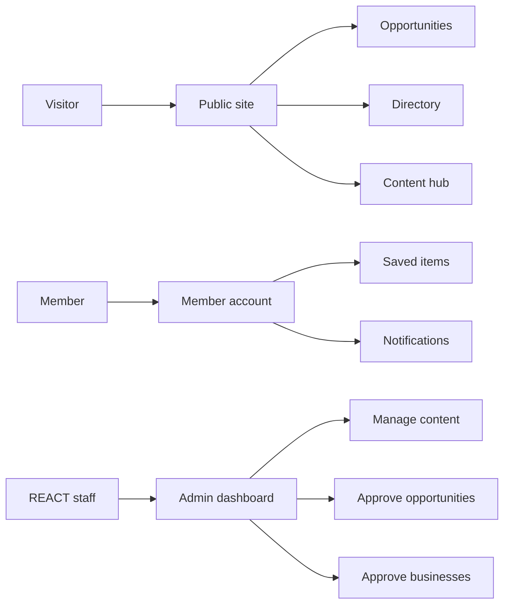

# What Sen React will be

Sen React is a **bilingual (French + English) digital platform for REACT** — a place where young Senegalese entrepreneurs and women find opportunities, connect with each other, learn, and engage with REACT's work.

It is designed from the ground up for:

- **Mobile-first use** (most of your audience is on a phone)
- **Intermittent connectivity** (the platform works even on slow, unstable connections)
- **Bilingual equality** (French is the default, English is a full equal, not an afterthought)
- **REACT ownership** (your team can change almost everything without needing a developer)

## The five pillars

### 1. Dashboard of Opportunities

One place for youth and women entrepreneurs to find:

- Calls for projects, grants, competitions
- Training programmes (yours + external)
- Events, fellowships, scholarships
- Business support schemes

Your REACT team will enter opportunities manually. The platform will **also automatically** pull from partner websites (ADEPME, APIX, DER/FJ, etc.) and present them to your team for **approval before publication** — so you keep full editorial control.

### 2. B2B Directory

A searchable directory of entrepreneurs and small businesses. Anyone can browse it, filter by sector and region, and contact listed businesses directly.

Business owners submit their own listing → REACT approves → it goes live.

### 3. Content Hub

Articles, news, and long-form posts by REACT and your partners. Training material. Success stories. Your six programmes (PROJET 3A, Si la Bokk, SenTAX, Sen Leadership Vert, AI for Change Actors, Graphic Power).

### 4. Member Space

Members create an account (email OR phone number + password — simple). They can:

- Save opportunities to a personal list
- Get notified when new opportunities match their profile
- Join REACT's network formally

### 5. Citizen Engagement

Space for citizens to contribute: propose ideas, comment on REACT's work, participate in initiatives. Details to be defined with you in the discovery template.

---

## How it will feel

- **For visitors** — a fast, beautiful site they can browse without logging in
- **For members** — a personal account with their saved content and notifications
- **For REACT staff** — an admin dashboard in French where they manage everything

## How REACT controls the platform

This is the most important architectural choice we have made:

> **After we finish building, your team controls the site through the admin dashboard. Adding pages, changing layouts, updating text, publishing new opportunities — none of this requires a developer.**

We are building a **template engine** — your team picks from a library of reusable "blocks" (hero sections, feature grids, opportunity lists, rich text, photo galleries, testimonials, etc.) and assembles pages like Lego. We will train your team to use it.

## The long-term path

1. **Today → Launch** — we build, you guide, we hand over.
2. **Year 1** — REACT staff run the platform themselves. We stay available for questions.
3. **Year 2+** — as REACT grows and secures funding, you subscribe to Claude (the AI we use to build this) — and your team can evolve the platform through natural-language conversation with AI. Make a new page, design a new feature, fix a bug — all by describing what you want.

This aligns with REACT's own mission: AI literacy, digital literacy, software engineering literacy.

You are not just getting a website. You are getting a platform designed so your team can grow its technical autonomy alongside it.
