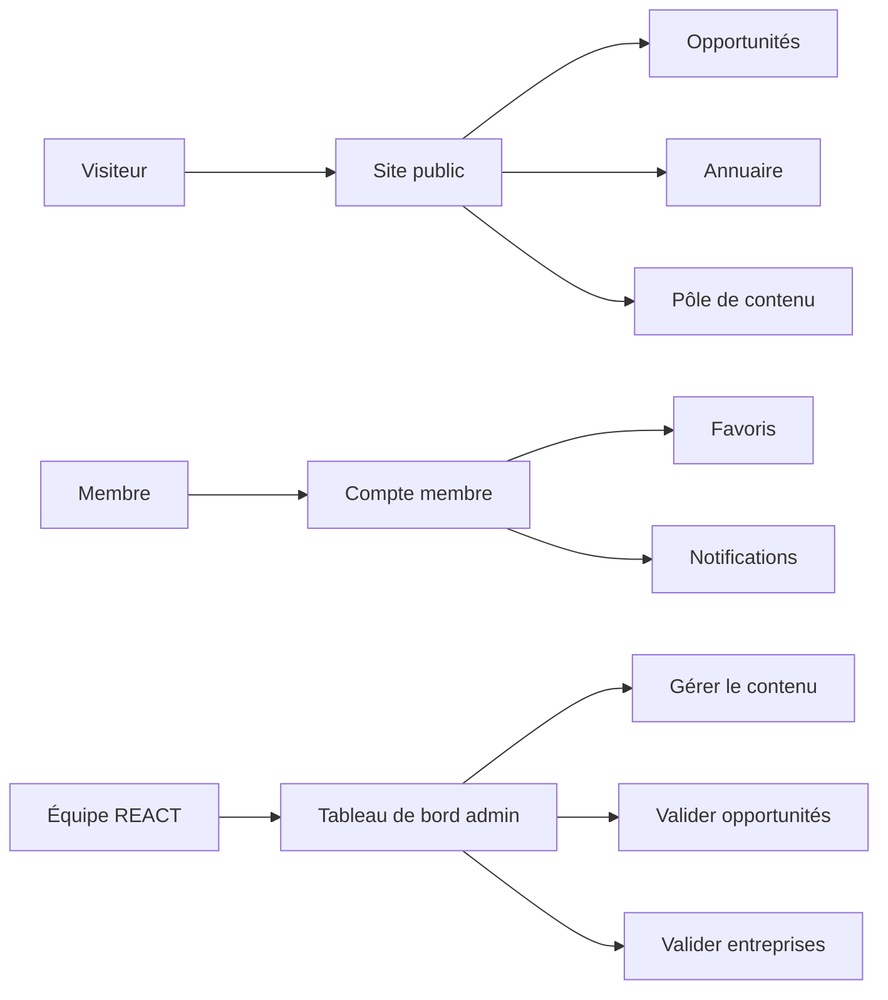

> **À vérifier par Amadou** : cette version française a été rédigée avec Claude. Merci de signaler toute tournure à corriger.

# Ce que sera Sen React

Sen React est une **plateforme numérique bilingue (français + anglais) pour REACT** — un espace où les jeunes entrepreneurs sénégalais et les femmes trouvent des opportunités, se connectent, apprennent, et s'engagent dans le travail de REACT.

Elle est conçue dès le départ pour :

- **Un usage mobile d'abord** (la majorité de votre public est sur téléphone)
- **Une connectivité intermittente** (la plateforme fonctionne même sur des connexions lentes ou instables)
- **Une égalité bilingue** (le français est la langue par défaut, l'anglais est un égal complet, pas une arrière-pensée)
- **La propriété de REACT** (votre équipe peut modifier presque tout sans passer par un développeur)

## Les cinq piliers

### 1. Tableau de bord des opportunités

Un lieu unique pour que les jeunes et les femmes entrepreneurs trouvent :

- Appels à projets, subventions, concours
- Programmes de formation (les vôtres + ceux de partenaires)
- Événements, bourses, stages
- Dispositifs d'appui aux entreprises

Votre équipe REACT saisira des opportunités manuellement. La plateforme **agrégera également** automatiquement depuis les sites partenaires (ADEPME, APIX, DER/FJ, etc.) et présentera chaque entrée à votre équipe pour **validation avant publication** — vous gardez le contrôle éditorial.

### 2. Annuaire B2B

Un annuaire d'entrepreneurs et de petites entreprises, avec moteur de recherche. N'importe qui peut le parcourir, filtrer par secteur et par région, et contacter les entreprises listées directement.

Les entrepreneurs soumettent leur fiche → REACT valide → publication.

### 3. Pôle de contenu

Articles, actualités, publications longues par REACT et vos partenaires. Supports de formation. Histoires de réussite. Vos six programmes (PROJET 3A, Si la Bokk, SenTAX, Sen Leadership Vert, AI for Change Actors, Graphic Power).

### 4. Espace membre

Les membres créent un compte (adresse e-mail OU numéro de téléphone + mot de passe — simple). Ils peuvent :

- Enregistrer des opportunités dans une liste personnelle
- Recevoir des notifications lorsqu'une nouvelle opportunité correspond à leur profil
- Rejoindre formellement le réseau REACT

### 5. Engagement citoyen

Un espace pour les citoyens contribuent : propositions d'idées, commentaires sur le travail de REACT, participation à des initiatives. À préciser avec vous dans le questionnaire de découverte.

---

## Vue d'ensemble

- **Pour les visiteurs** — un site rapide et soigné qu'ils peuvent parcourir sans se connecter
- **Pour les membres** — un compte personnel avec leur contenu enregistré et leurs notifications
- **Pour l'équipe REACT** — un tableau de bord d'administration en français où tout se gère

## Comment REACT contrôle la plateforme

C'est le choix d'architecture le plus important que nous ayons fait :

> **Après la livraison, votre équipe contrôle le site via le tableau de bord d'administration. Ajouter des pages, modifier les mises en page, mettre à jour les textes, publier de nouvelles opportunités — rien de tout cela ne demande un développeur.**

Nous construisons un **moteur de gabarits** — votre équipe choisit dans une bibliothèque de « blocs » réutilisables (sections en-tête, grilles de fonctionnalités, listes d'opportunités, texte riche, galeries photos, témoignages, etc.) et assemble les pages comme des briques Lego. Nous formerons votre équipe à l'utiliser.

## La trajectoire à long terme

1. **Aujourd'hui → Lancement** — nous construisons, vous guidez, nous livrons.
2. **Année 1** — l'équipe REACT fait tourner la plateforme elle-même. Nous restons disponibles pour les questions.
3. **Année 2 et au-delà** — à mesure que REACT grandit et sécurise ses financements, vous vous abonnez à Claude (l'IA que nous utilisons pour construire ceci) — et votre équipe peut faire évoluer la plateforme par conversation en langage naturel avec l'IA. Créer une nouvelle page, concevoir une nouvelle fonctionnalité, corriger une anomalie — tout cela en décrivant simplement ce que vous voulez.

Ceci s'inscrit dans la mission même de REACT : littératie en IA, littératie numérique, littératie en ingénierie logicielle.

Vous n'obtenez pas seulement un site internet. Vous obtenez une plateforme conçue pour que votre équipe développe son autonomie technique en même temps qu'elle.
