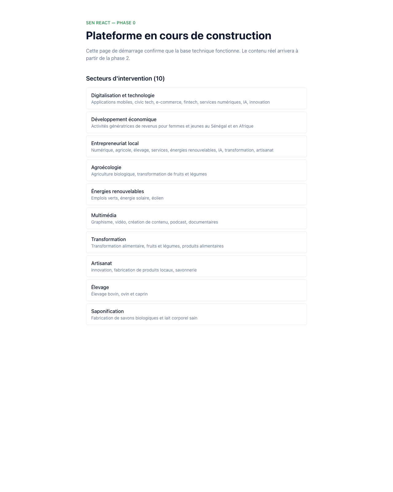

# Phase 0 — Validation Artefact

**Phase:** 0 — Pre-flight scaffolding
**Run timestamp:** 2026-05-09T10:11+02:00 (SAST)
**Git HEAD at validation:** `bb367d5` — *PR-0b-ii: Vitest + Playwright + CI test step (#3)*
**Branch at validation:** `feat/verify-phase-skills` (this PR's branch — running from a freshly-merged main)
**Status:** Phase 0 LOCKED — all 7 validation-contract checks green.

---

## Validation contract checks

| # | Check | Tool | Result | Detail |
|---|---|---|---|---|
| 1 | Compiles | `pnpm build` (root, recursive) | ✅ | 9s — apps/web 3 static pages, apps/cms 7 routes, packages/shared typecheck-only |
| 2 | Type-clean | `pnpm typecheck` (strict TS) | ✅ | 2s — 3 packages, all clean |
| 3 | Lint-clean | `pnpm lint` (ESLint 9 flat, max-warnings 0) | ✅ | 3s |
| 4 | Format-clean | `pnpm format:check` (Prettier 3) | ✅ | <1s |
| 5 | Tests | `pnpm test` (Vitest, 3 packages) | ✅ | 1s — 20/20 passed (shared 12, web 3, cms 5) |
| 6 | CI/CD + preview | GH Actions + Vercel | ✅ | Latest CI run on `main`: success ([25596081315](https://github.com/tomasi001/sen-react/actions/runs/25596081315)). Latest Vercel deploy: READY at `https://sen-react-hhg7o7tey-tomasi001s-projects.vercel.app`. Prod alias `https://sen-react.vercel.app` HTTP 200. |
| 7 | Chrome MCP visual | Playwright headless capture (canonical) + Chrome MCP (live sanity) | ✅ | Homepage render matches the FR Phase 0 placeholder; html lang="fr"; 10 sectors visible. See screenshot below. |

---

## CI/CD context (check 6)

- **CI workflow** (`.github/workflows/ci.yml`): pinned pnpm 9.15.4 + Node 22. Pipeline: install (frozen lockfile) → lint → format:check → typecheck → test (Vitest, 20 cases) → build → audit (`pnpm audit --prod --audit-level=high`).
- **E2E workflow** (`.github/workflows/e2e.yml`): triggered by Vercel `deployment_status` event. Runs Playwright smoke against the deployment URL. Browser cache keyed off `pnpm-lock.yaml`. Reports uploaded as artefacts.
- **Branch protection on `main`:** PR required, status check `Lint, format, typecheck, build` required, linear history enforced, no force-pushes, no deletions.
- **Pre-commit hook** (`.husky/pre-commit`): runs `pnpm exec lint-staged` — eslint --fix + prettier --write on staged files. Verified firing on the last 4 commits.

---

## Preview protection decision

- **Choice:** **(a) publicly accessible** — Vercel SSO disabled on previews
- **Rationale:** Sen React is a public-facing non-profit marketing site with no sensitive content in the static build. The convenience of CI being able to hit preview URLs without bypass-token plumbing outweighs the (negligible) downside of preview URLs being indexable. Future paid-client projects will pick (b) — protected with a CI bypass token — instead.

---

## Visual verification (check 7)

Captured against production via `node scripts/capture-screenshot.mjs https://sen-react.vercel.app docs/screenshots/phase-0/homepage.png` (Playwright headless, viewport 1280×1600, color-scheme `light`, no extensions).

**Asserted on the page:**
- Title `Sen React`
- `<html lang="fr">` per D010 Q2
- "Plateforme en cours de construction" hero copy
- "Secteurs d'intervention (10)" heading
- All 10 sectors rendered with FR labels and scope strings — Digitalisation et technologie, Développement économique, Entrepreneuriat local, Agroécologie, Énergies renouvelables, Multimédia, Transformation, Artisanat, Élevage, Saponification

**Note on the dual-tool screenshot strategy:** Chrome MCP and Playwright headless can produce visibly different captures of the same URL when the user's Chrome has a dark-mode extension or experimental `prefers-color-scheme` override active. Playwright headless with explicit `colorScheme: 'light'` and no extensions is the canonical reference and is what's committed here. Chrome MCP remains useful as a live sanity check during a conversation.

---

## What landed across Phase 0

- **PR-0a** (initial commits `a8be600`, `fee731b`) — pnpm workspace, `apps/web` Next.js 16 with FR-primary locale, `apps/cms` placeholder, `packages/shared` (LocaleSchema, SECTORS), root ESLint 9 + Prettier 3 + tsconfig project references, `.env.example`.
- **PR-0a-ii** (`dfa6891`) — `apps/cms` Payload 3.84.1 scaffold pointed at Supabase under a dedicated `payload` schema. Hardened from the start: explicit CORS + CSRF allow-list, `pnpm.overrides` clearing 11 transitive CVEs (dompurify, uuid, postcss, esbuild).
- **PR-0a-iii** (`3b14299`, PR #2) — Husky + lint-staged pre-commit gate; audit-02-secrets-env-deploy baseline run + report (22 findings, 0 critical post-remediation).
- **PR-0b** (`61b368c`, in PR #1) — GH Actions CI workflow.
- **PR-0b-ii** (`bb367d5`, PR #3) — Vitest in 3 packages with 20 real assertions + Playwright e2e smoke + e2e workflow triggered by Vercel deployment_status.
- **PR-0c** (this PR) — `verify-phase` and `visual-check` skills at `~/.claude/skills/`, project-side `scripts/capture-screenshot.mjs`, this validation artefact.

---

## Skills available after this phase

User-scope (`~/.claude/skills/`):
- `verify-phase` — runs the 7-check contract, writes per-phase artefact
- `visual-check` — Playwright canonical + Chrome MCP sanity, with the dual-tool note encoded in the skill body
- `audit-02-secrets-env-deploy` — chunk-2 compliance audit (already run once)
- `remediate-02-secrets-env-deploy`, `audit-01-db-integrity`, `remediate-01-db-integrity` — scaffolded, not yet run against sen-react

---

## Lock criterion

Phase 0 locks when checks 1-7 are all ✅. **Current state: LOCKED.**

---

## Next phase

Phase 1 — Foundation (auth via Supabase email+password per D015, root layout, header/footer/nav from CMS globals, FR locale only, deploy stub). 🟢 Green per the roadmap — no blockers, no Amadou-pending answers. Opens after PR-0c merges.
