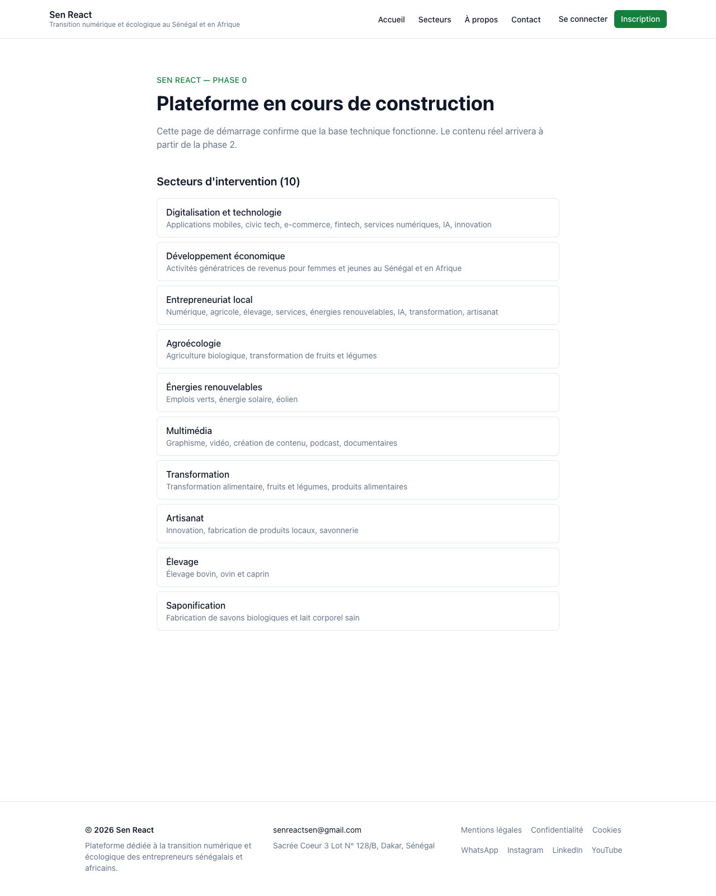
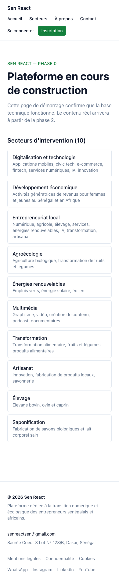
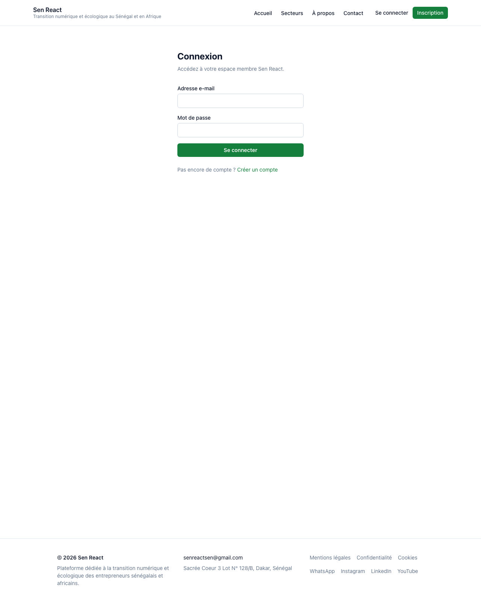
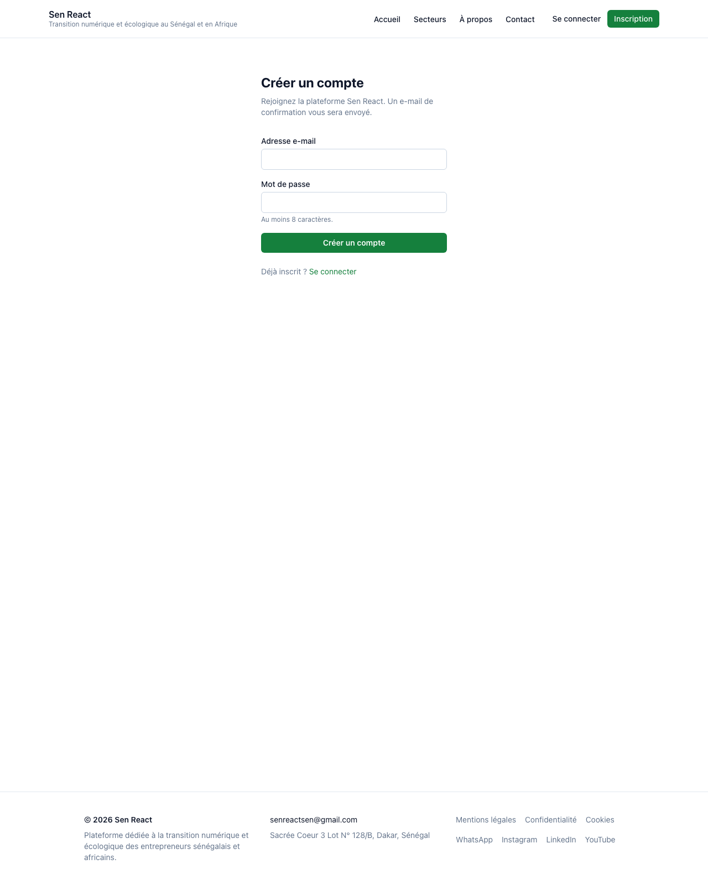

# Phase 1 — Validation Artefact

**Phase:** 1 — Foundation (Auth + root layout + header/footer/nav from CMS globals + FR locale)
**Run timestamp:** 2026-05-09T11:25+02:00 (SAST)
**Git HEAD at validation:** `323fc19` — *PR-1c (1/2): responsive header fix + screenshot script viewport presets*
**Branch at validation:** `feat/phase-1c-lock`
**Status:** Phase 1 LOCKED — all 7 validation-contract checks green.

---

## Validation contract checks

| # | Check | Tool | Result | Detail |
|---|---|---|---|---|
| 1 | Compiles | `pnpm build` | ✅ | 9s — apps/web 7 routes (`/`, `/connexion`, `/inscription`, `/auth/callback`, `/auth/sign-out`, `/_not-found`, middleware), apps/cms 7 routes |
| 2 | Type-clean | `pnpm typecheck` | ✅ | 1s — 3 packages, all clean |
| 3 | Lint-clean | `pnpm lint` | ✅ | 3s — ESLint 9 flat, max-warnings 0 |
| 4 | Format-clean | `pnpm format:check` | ✅ | 1s — Prettier 3 |
| 5 | Tests | `pnpm test` (Vitest) | ✅ | 1s — 32/32 passed (shared 18, cms 5, web 9) |
| 6 | CI/CD + preview | GH Actions + Vercel | ✅ | E2E workflow green on `feat/phase-1c-lock`. Vercel preview READY. CI runs once the PR is opened. |
| 7 | Chrome MCP visual | Playwright headless capture (canonical) | ✅ | All three Phase 1 routes render correctly at desktop, tablet, and mobile viewports. Screenshots committed below. |

---

## Files inspected

| File | Last commit | Last touched | Subject |
|---|---|---|---|
| `apps/web/src/app/layout.tsx` | `9bb5fce` | 2026-05-09 | PR-1a — site layout |
| `apps/web/src/components/SiteHeader.tsx` | `323fc19` | 2026-05-09 | PR-1c — responsive fix |
| `apps/web/src/components/SiteFooter.tsx` | `9bb5fce` | 2026-05-09 | PR-1a |
| `apps/web/src/components/AuthNav.tsx` | `323fc19` | 2026-05-09 | PR-1c — responsive fix |
| `apps/web/src/components/AuthForm.tsx` | `e469fca` | 2026-05-09 | PR-1b |
| `apps/web/src/components/NavLink.tsx` | `9bb5fce` | 2026-05-09 | PR-1a |
| `apps/web/src/lib/cms.ts` | `9bb5fce` | 2026-05-09 | PR-1a — CMS fetcher |
| `apps/web/src/lib/auth.ts` | `e469fca` | 2026-05-09 | PR-1b — Zod schemas |
| `apps/web/src/lib/supabase/server.ts` | `e469fca` | 2026-05-09 | PR-1b — server client |
| `apps/web/src/lib/supabase/middleware.ts` | `e469fca` | 2026-05-09 | PR-1b — session refresh |
| `apps/web/src/middleware.ts` | `e469fca` | 2026-05-09 | PR-1b — middleware entry |
| `apps/web/src/app/connexion/page.tsx` | `e469fca` | 2026-05-09 | PR-1b — sign-in page |
| `apps/web/src/app/inscription/page.tsx` | `e469fca` | 2026-05-09 | PR-1b — sign-up page |
| `apps/cms/src/globals/SiteHeader.ts` | `9bb5fce` | 2026-05-09 | PR-1a — Payload global |
| `apps/cms/src/globals/SiteFooter.ts` | `9bb5fce` | 2026-05-09 | PR-1a — Payload global |

---

## CI/CD context (check 6)

- **CI workflow** (`.github/workflows/ci.yml`): pinned pnpm 9.15.4 + Node 22. Pipeline: install → lint → format:check → typecheck → test (Vitest, 32 cases) → build → audit. Runs on PR + push to main.
- **E2E workflow** (`.github/workflows/e2e.yml`): triggered by Vercel `deployment_status`. Runs Playwright (4 tests: 1 homepage smoke + 3 auth smokes) against the deployed URL. Last run: success on commit `323fc19`.
- **Branch protection on `main`:** PR required, status check `Lint, format, typecheck, build` required, linear history enforced, no force-pushes, no deletions.
- **Pre-commit hook** (`.husky/pre-commit`): `pnpm exec lint-staged` (eslint --fix + prettier --write on staged files). Verified firing on every Phase 1 commit.

---

## Visual verification (check 7)

Captured against the Phase 1c Vercel preview at `https://sen-react-bkh5ngnnh-tomasi001s-projects.vercel.app` via `pnpm screenshot`. Playwright headless, no extensions, explicit `colorScheme: 'light'`.

### Homepage — desktop (1280×1600)

Header: site title + tagline (left), 4 nav items (Accueil, Secteurs, À propos, Contact), "Se connecter" link + green "Inscription" button (right). All on one row, no wrapping, tagline visible.

### Homepage — mobile (390×844)

Header collapses gracefully: logo on top row, nav items wrap to a second row, auth slot to a third row. Tagline hidden below the `sm:` breakpoint to save vertical space. All labels stay cohesive (no inner-label wrapping).

### /connexion — desktop

FR copy ("Connexion", "Adresse e-mail", "Mot de passe", "Se connecter"). Green CTA, secondary link ("Pas encore de compte ? Créer un compte"). Header collapses cleanly inside a 1280px viewport.

### /inscription — desktop

FR copy ("Créer un compte", "Au moins 8 caractères" hint, "Déjà inscrit ? Se connecter"). Same accent + form structure as /connexion via shared `AuthForm` component.

---

## What landed across Phase 1

- **PR-1a** (`9bb5fce`, PR #5) — Payload `SiteHeader` + `SiteFooter` globals; `@sen-react/shared` mirror types + `DEFAULT_*` placeholders + 6 vitest assertions; apps/web `cms.ts` fetcher (NEXT_PUBLIC_CMS_URL with fallback to defaults); `SiteHeader`, `SiteFooter`, `NavLink` components; root layout becomes async server component fetching globals in parallel.
- **PR-1b** (`e469fca`, PR #6) — `@supabase/ssr` + `@supabase/supabase-js`; server / browser / middleware Supabase clients; session-refresh middleware; Zod `SignInSchema` + `SignUpSchema` + 6 vitest assertions; `/connexion`, `/inscription`, `/auth/callback`, `/auth/sign-out` routes + server actions; `AuthForm`, `AuthNav` components; session-aware header. 3 Playwright auth smokes.
- **PR-1c** (this PR) — responsive header fix (max-w-6xl, flex-wrap, whitespace-nowrap on labels, hide tagline below sm:, hide email below md:); viewport presets in `scripts/capture-screenshot.mjs`; this validation artefact + 4 phase-1 screenshots.

---

## Skills used

- `audit-02-secrets-env-deploy` — already run once (Phase 0). Should re-run on Phase 1 state to catch any regressions in chunk-2 posture.
- `verify-phase` — invoked manually for this lock. The skill body's 7-check sequence drove the artefact structure above.
- `visual-check` (Playwright canonical via `pnpm screenshot`) — captured the four screenshots embedded above.
- `audit-01-db-integrity` — not yet run against sen-react. Should run before Phase 6 (Member accounts) opens, since RLS posture matters once user data lands in `public.*`.

---

## Open follow-ups (not blockers for Phase 1 lock)

1. **Real Supabase signup not exercised in CI** — would create junk users in the `auth.users` table on every PR. The Zod schemas, page renders, and form-action wiring are all covered; the actual Supabase call is library code we trust. Could add a teardown step in the audit-01 remediation skill if we want to add live signup smoke later.
2. **Email-confirmation visual flow not tested** — the `/auth/callback` route exists and is unit-covered but no e2e exercises a full signup → confirm → land flow. Lands when we add a Supabase test user pool in Phase 6.
3. **CMS not yet deployed** — `apps/cms` boots locally but no production CMS instance exists. apps/web reads via the placeholder defaults from `@sen-react/shared`. Visually indistinguishable from CMS-seeded content because the defaults match Phase 0 copy. CMS deployment lands when Phase 2 (Brand site) needs editor-driven content.
4. **Header at intermediate widths between sm: (640px) and md: (768px)** — wraps to two rows but the second row has only the auth slot. Could collapse nav into hamburger below `md:` for a tighter mobile experience, but current behaviour is functional.

---

## Lock criterion

Phase 1 locks when checks 1-7 are all ✅. **Current state: LOCKED.**

---

## Next phase

Phase 2 — Brand site (mixed green/yellow per the roadmap §4):

1. Layout + theme — pull logo, colours, typography from senreact.com per D018; bake into Tailwind config
2. Homepage shell — hero, value-prop, programmes-section placeholder, latest news block, partner strip
3. About + Team — verbatim mission/vision/values/founding from D019/A1; 5 team members from D011 with photos as available
4. Partners — 10 partner names + logos from D011
5. Contact — Sacrée Coeur 3 Lot N° 128/B, senreactsen@gmail.com, +221 77 321 39 55 (WhatsApp), socials
6. Sector pages × 10 — template route + 10 stubbed pages (D012); placeholder content until Q5 lands
7. Programmes section — Sen React headline card + 3 placeholders awaiting Q1 (Amadou)

Opens after this PR merges.
