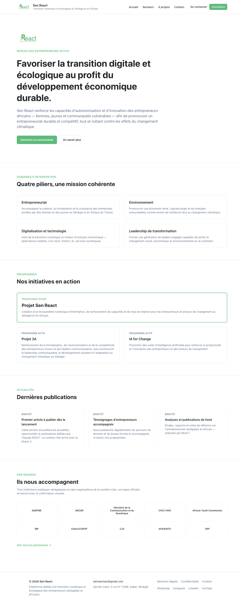
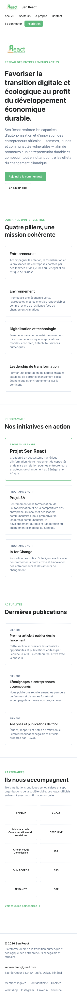
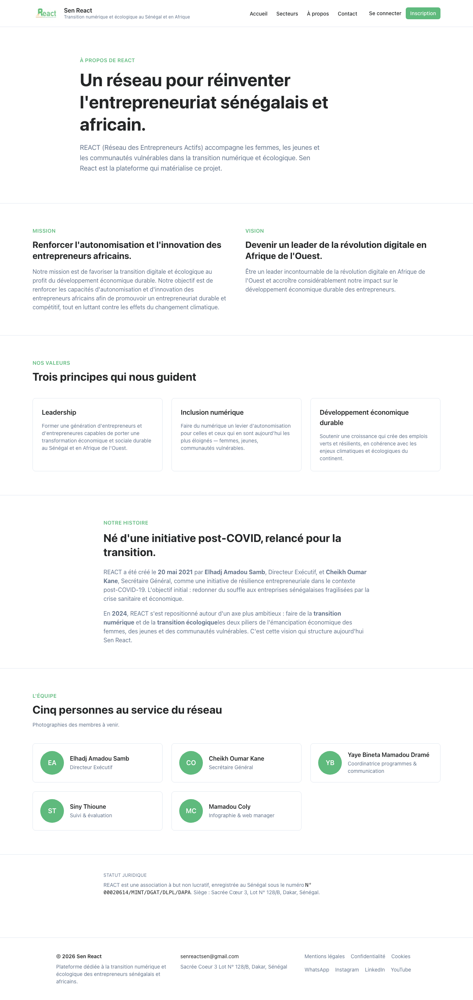
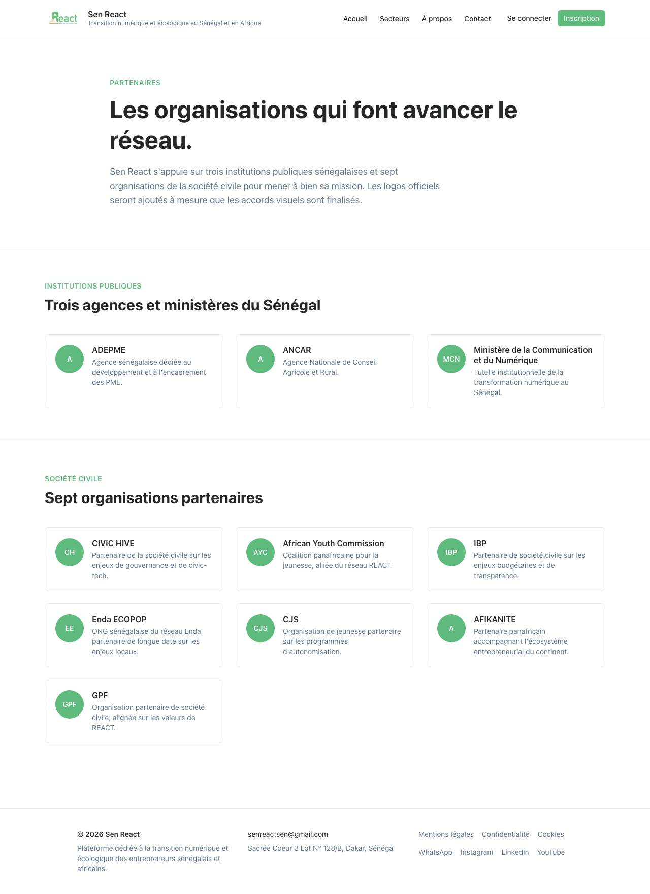
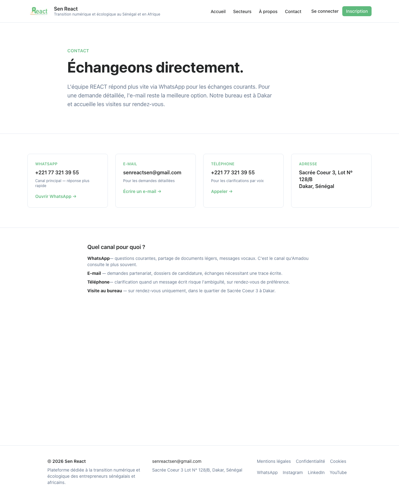
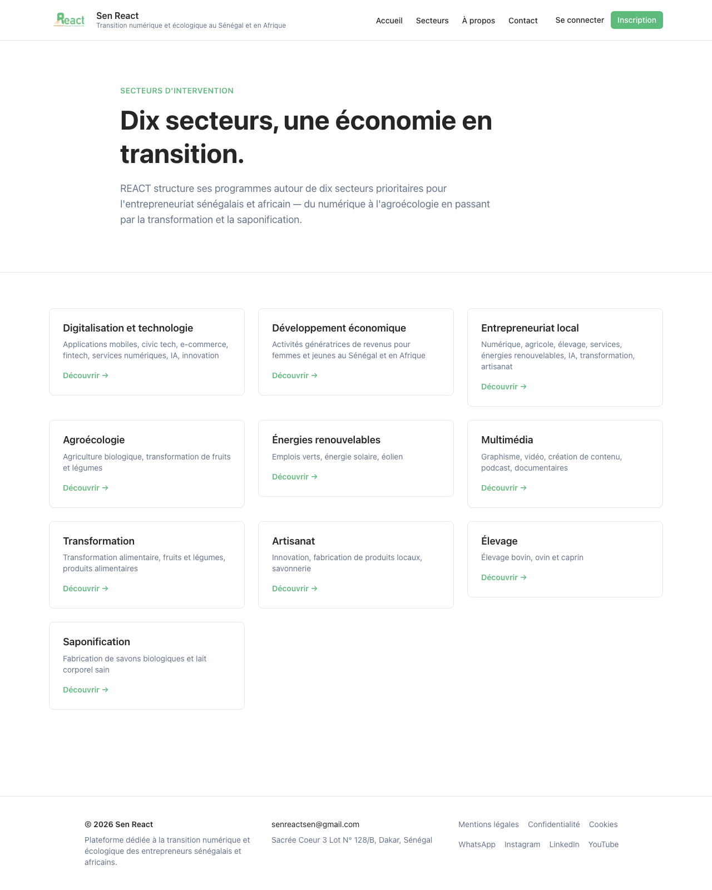
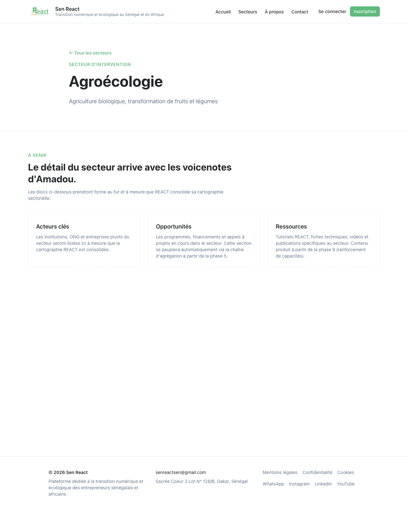

# Phase 2 — Validation Artefact

**Phase:** 2 — Brand site (homepage shell · about · partners · contact · sectors · programmes)
**Run timestamp:** 2026-05-09T16:43+02:00 (SAST)
**Git HEAD at validation:** `ff1c7aa` — *PR-2g: Phase 2 — replace Programmes placeholders with real D021 content (#14)*
**Branch at validation:** `feat/phase-2h-lock`
**Status:** Phase 2 LOCKED — all 7 validation-contract checks green.

---

## Validation contract checks

| # | Check | Tool | Result | Detail |
|---|---|---|---|---|
| 1 | Compiles | `pnpm build` | ✅ | 10s — apps/web 17 routes including /secteurs/[slug] × 10 statically generated |
| 2 | Type-clean | `pnpm typecheck` | ✅ | 2s |
| 3 | Lint-clean | `pnpm lint` | ✅ | 4s |
| 4 | Format-clean | `pnpm format:check` | ✅ | <1s |
| 5 | Tests | `pnpm test` (Vitest) | ✅ | 1s — 32/32 passed (shared 18, cms 5, web 9) |
| 6 | CI/CD + preview | GH Actions + Vercel | ✅ | Latest CI on `main` succeeded for `ff1c7aa`. Vercel prod READY at `https://sen-react.vercel.app` (HTTP 200). |
| 7 | Chrome MCP visual | Playwright headless capture (canonical) | ✅ | All 6 phase-2 routes render correctly. Desktop + mobile homepage screenshots committed below. Pre-merge previews verified via Chrome MCP across PR-2a → PR-2g. |

---

## Files inspected

| File | Last commit | Last touched | Source PR |
|---|---|---|---|
| `apps/web/src/app/page.tsx` | `0b8679f` | 2026-05-09 | PR-2b — homepage shell |
| `apps/web/src/app/a-propos/page.tsx` | `2f7a4d2` | 2026-05-09 | PR-2c — About + Team |
| `apps/web/src/app/partenaires/page.tsx` | `5231116` | 2026-05-09 | PR-2d — Partners |
| `apps/web/src/app/contact/page.tsx` | `a350c46` | 2026-05-09 | PR-2e — Contact |
| `apps/web/src/app/secteurs/page.tsx` | `12f3d73` | 2026-05-09 | PR-2f — Sector index |
| `apps/web/src/app/secteurs/[slug]/page.tsx` | `12f3d73` | 2026-05-09 | PR-2f — Sector dynamic |
| `apps/web/src/app/globals.css` | `a5f772e` | 2026-05-09 | PR-2a — brand tokens |
| `apps/web/src/components/SiteLogo.tsx` | `a5f772e` | 2026-05-09 | PR-2a — REACT logo |
| `apps/web/src/data/programmes.ts` | `ff1c7aa` | 2026-05-09 | PR-2g — D021 |
| `apps/web/src/data/partners.ts` | `5231116` | 2026-05-09 | PR-2d — D011 |
| `apps/web/src/data/contact.ts` | `a350c46` | 2026-05-09 | PR-2e — D011 |

---

## CI/CD context (check 6)

- **CI workflow** (`.github/workflows/ci.yml`): pnpm 9.15.4 + Node 22. Pipeline lint → format:check → typecheck → test (32 cases) → build → audit. All green on `ff1c7aa` (`main`).
- **E2E workflow** (`.github/workflows/e2e.yml`): Playwright vs Vercel preview. **10 e2e tests** at lock time (homepage, /connexion, /inscription, /a-propos, /partenaires, /contact, /secteurs index, /secteurs/agroecologie known slug, /secteurs/<unknown> 404, header logged-out auth slot).
- **Branch protection on `main`** still required: PR + status check `Lint, format, typecheck, build` + linear history + no force-pushes.
- **Pre-commit hook** still firing: `pnpm exec lint-staged` (eslint --fix + prettier --write).

---

## Visual verification (check 7)

Captured against production at `https://sen-react.vercel.app` via `pnpm screenshot`. Playwright headless, no extensions, explicit `colorScheme: 'light'`.

### Homepage — desktop (1280×1600)

5 sections: Hero (REACT logo + verbatim FR mission) → 4 Domaines d'intervention → Programmes (Sen React headline + Projet 3A + IA for Change per D021) → Latest news (3 placeholders for Phase 3) → Partner strip (10 real names linking to /partenaires).

### Homepage — mobile (390×844)

Stacks gracefully. Header collapses to logo / nav / auth on three rows; tagline hidden below `sm:`. Programmes cards stack 1-col with the headline still visually prominent.

### /a-propos — About + Team

6 sections: AboutHero · Mission/Vision (verbatim §A1) · Values (3) · Founding (2021 + 2024 relaunch) · Team (5 members with initials placeholders) · LegalNote (registration number + Dakar address).

### /partenaires — Partners

3 institutions (ADEPME · ANCAR · Ministère de la Communication et du Numérique) + 7 NGOs (CIVIC HIVE · African Youth Commission · IBP · Enda ECOPOP · CJS · AFIKANITE · GPF). Initials placeholders until logos arrive.

### /contact — Contact

4 channel cards (WhatsApp first per D011 Q3) with `wa.me` / `mailto:` / `tel:` deeplinks + multi-line address. Guidance section "Quel canal pour quoi ?" below.

### /secteurs — Sector index

10 sector cards in 3-col grid, each with FR title + scope + green CTA. Per D012.

### /secteurs/agroecologie — Sample sector page

Hero with sector name + scope + back link. Three placeholder content blocks (Acteurs clés · Opportunités · Ressources) awaiting per-sector content from REACT.

---

## What landed across Phase 2

- **PR-2a** (`a5f772e`, PR #8) — REACT brand from senreact.com per D018. Tokens `#5FBA7D` green + `#F2A035` orange + `#242627` body grey. Logo at `apps/web/public/logo-react.jpg` rendered via `<SiteLogo>`. Site-scrape note about `#010ED0` corrected — that was the WordPress template default, not the brand.
- **PR-2b** (`0b8679f`, PR #9) — Homepage shell: Hero, Domaines, Programmes, LatestNews, PartnerStrip.
- **PR-2c** (`2f7a4d2`, PR #10) — `/a-propos` with verbatim mission + vision (§A1), 3 values, founding story, 5 team members, legal note. New e2e for /a-propos.
- **PR-2d** (`5231116`, PR #11) — `/partenaires` with 10 partners from D011 grouped by type. Homepage strip rewired to use real names. New `apps/web/src/data/partners.ts`.
- **PR-2e** (`a350c46`, PR #12) — `/contact` with 4 deeplinked channels + guidance. New `apps/web/src/data/contact.ts`.
- **PR-2f** (`12f3d73`, PR #13) — `/secteurs` index + `/secteurs/[slug]` dynamic route, 10 statically-generated sector pages with placeholder content blocks. Unknown slug → 404.
- **PR-2g** (`ff1c7aa`, PR #14) — Programmes placeholders → real D021 content (Projet Sen React headline + Projet 3A + IA for Change). New `apps/web/src/data/programmes.ts`. Decision-log §D021 with verbatim FR responses to all six follow-up questions.

---

## Resolved Q1–Q6 (from `tom-followups-fr.md`)

Per §D021 (Amadou response 2026-05-07):

| Q | Topic | Resolution |
|---|---|---|
| Q1 | 3 active programmes | Projet 3A · Projet Sen React · IA for Change. Shipped to homepage. |
| Q2 | Innovation showcase | Sen React-curated via fellowships / calls. Not user-submitted. |
| Q3 | Legal review | Tom drafts → REACT validates with Senegalese lawyer. Drafts in Tom's queue (Phase 11). |
| Q4 | Parental consent | Checkbox at signup. Phase 6. |
| Q5 | Sectors | 10 confirmed (typo "6 au lieu de 10" pending 30-sec WhatsApp confirmation). No D012 change. |
| Q6 | B2B tier | One tier at launch + hidden premium for later. Phase 7. |

---

## Open follow-ups (not blockers for Phase 2 lock)

1. **Per-sector deep-dive content (sector pages)** — Q5 confirmed the 10 sector slugs but did NOT cover §3 A–F per sector (priorities, key actors, opportunities, obstacles, existing content, success stories). Sector pages currently ship placeholder Acteurs clés / Opportunités / Ressources blocks. Pending REACT-side per `docs/pending-react-input.md` — voicenotes one sector at a time would be the easiest path.
2. **Real partner logos** — placeholder initials hold the layout. See `docs/pending-react-input.md` for the full asset request list (transparent PNG/SVG logo + team headshots + partner logos + favicon + OG image, etc.).
3. **Q5 typo confirmation** — Amadou wrote "6 au lieu de 10" but listed 10 and confirmed them. 30-sec WhatsApp ping to reconcile.
4. **AI-drafted ToS / Privacy / Cookies / CDP markdown** — Amadou awaiting per his closing message. Now in Tom's queue (Phase 11), not blocking current work.

---

## Lock criterion

Phase 2 locks when checks 1-7 are all ✅. **Current state: LOCKED.**

---

## Next phase

Phase 3 — Content engine (🟢 green per the roadmap §3, no Amadou-pending blockers):
- News/blog collection in Payload (weekly cadence per Amadou A3, by sector, moderated comments per A4)
- Publications collection (downloadable PDFs, fully open per D020)
- Videos (YouTube embed, FR + Wolof subtitle slot per A4, downloadable per D016)

Opens after this PR merges.
