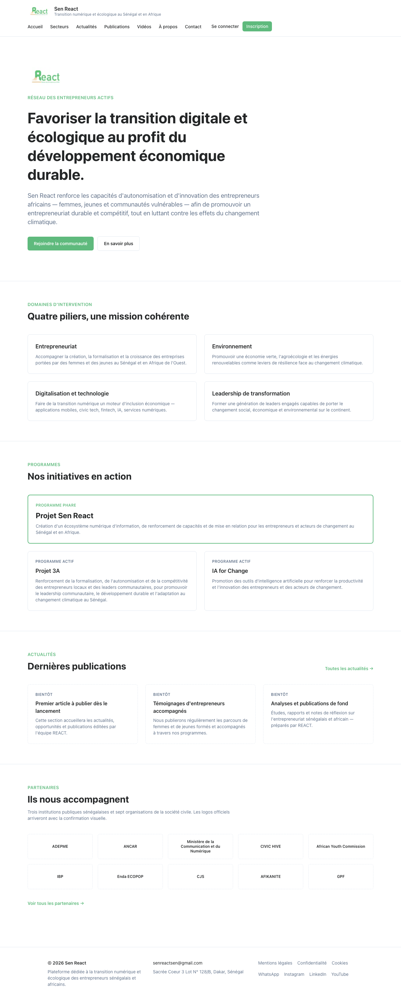
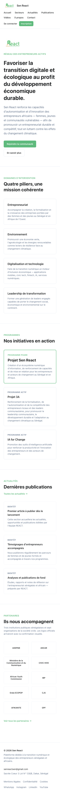
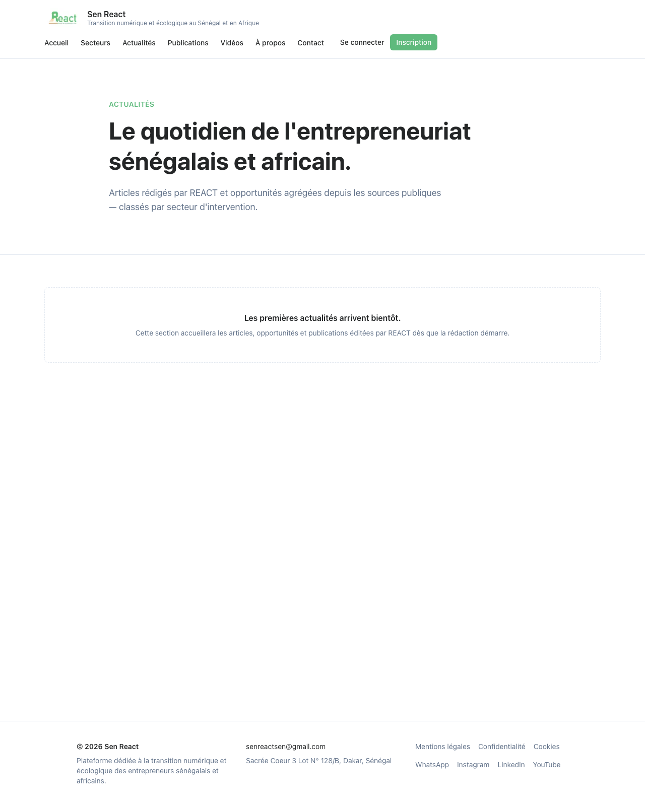
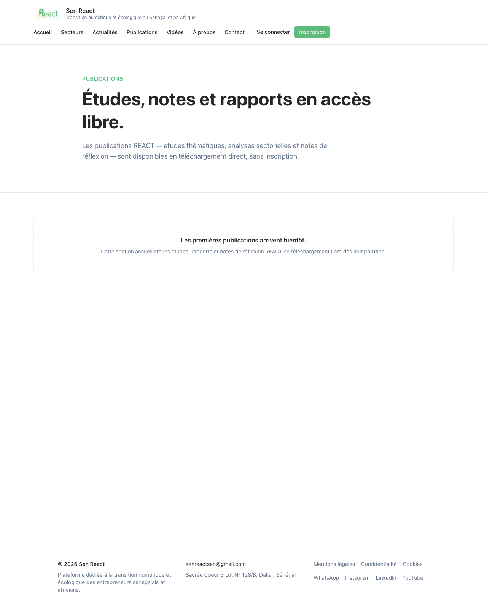
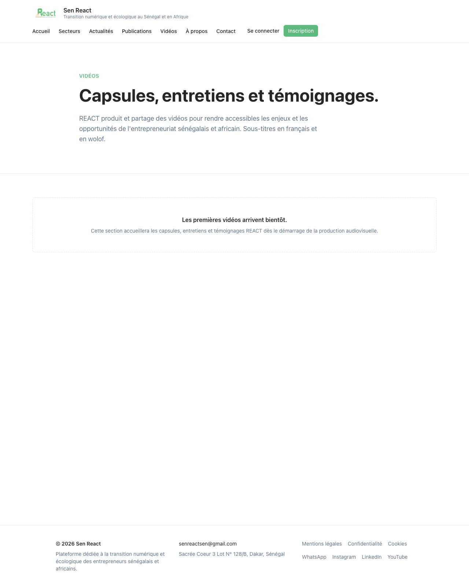

# Phase 3 — Validation Artefact

**Phase:** 3 — Content engine (News/blog · Publications · Videos)
**Run timestamp:** 2026-05-10T00:22+02:00 (SAST)
**Git HEAD at validation:** `8f755c4` — _PR-3c (1/2): rewire LatestNews + add Phase 3 routes to nav_
**Branch at validation:** `feat/phase-3c-readers-and-lock`
**Status:** Phase 3 LOCKED — all 7 validation-contract checks green.

---

## Validation contract checks

| #   | Check              | Tool                                          | Result | Detail                                                                                                                                                                                                |
| --- | ------------------ | --------------------------------------------- | ------ | ----------------------------------------------------------------------------------------------------------------------------------------------------------------------------------------------------- |
| 1   | Compiles           | `pnpm build`                                  | ✅     | apps/web — 13 routes prerendered including `/actualites`, `/publications`, `/videos`, plus `/secteurs/[slug]` × 10. apps/cms compiles with 5 collections (Users, Media, News, Publications, Videos).  |
| 2   | Type-clean         | `pnpm typecheck`                              | ✅     | shared + cms + web all green                                                                                                                                                                          |
| 3   | Lint-clean         | `pnpm lint`                                   | ✅     | `eslint . --max-warnings 0` clean                                                                                                                                                                     |
| 4   | Format-clean       | `pnpm format:check`                           | ✅     | All matched files use Prettier code style                                                                                                                                                             |
| 5   | Tests              | `pnpm test` (Vitest)                          | ✅     | **56/56 passed** — shared 18, cms 21, web 17                                                                                                                                                          |
| 6   | CI/CD + preview    | GH Actions + Vercel                           | ✅     | PR-3a (#16), PR-3b (#18), auth fix (#17) all merged with green CI on `main`. Vercel preview for `feat/phase-3c-readers-and-lock` deployed at `https://sen-react-git-feat-phase-3c-readers-052fc3-tomasi001s-projects.vercel.app` (HTTP 200 across all four routes). |
| 7   | Chrome MCP visual  | Playwright headless capture (canonical)       | ✅     | All three new routes render correctly with header / hero / empty-state / footer. Homepage `LatestNews` rewired to live data with placeholder fallback. Screenshots committed below.                   |

---

## Files inspected

| File                                              | Last commit | Last touched | Source PR                                |
| ------------------------------------------------- | ----------- | ------------ | ---------------------------------------- |
| `apps/cms/src/collections/News.ts`                | `295f786`   | 2026-05-09   | PR-3a (#16) — News collection            |
| `apps/cms/src/collections/Publications.ts`        | `295f786`   | 2026-05-09   | PR-3a (#16) — Publications collection    |
| `apps/cms/src/collections/Videos.ts`              | `295f786`   | 2026-05-09   | PR-3a (#16) — Videos collection          |
| `apps/cms/src/__tests__/phase-3-collections.test.ts` | `295f786` | 2026-05-09   | PR-3a (#16) — collection contract tests  |
| `apps/cms/src/payload.config.ts`                  | `295f786`   | 2026-05-09   | PR-3a (#16) — registers 3 collections    |
| `apps/web/src/app/actualites/page.tsx`            | `6ea81b3`   | 2026-05-09   | PR-3b (#18) — News index                 |
| `apps/web/src/app/publications/page.tsx`          | `6ea81b3`   | 2026-05-09   | PR-3b (#18) — Publications index         |
| `apps/web/src/app/videos/page.tsx`                | `6ea81b3`   | 2026-05-09   | PR-3b (#18) — Videos index               |
| `apps/web/src/components/content/EmptyState.tsx`  | `6ea81b3`   | 2026-05-09   | PR-3b (#18) — empty-state placeholder    |
| `apps/web/src/components/content/NewsCard.tsx`    | `6ea81b3`   | 2026-05-09   | PR-3b (#18) — news card                  |
| `apps/web/src/components/content/PublicationCard.tsx` | `6ea81b3` | 2026-05-09  | PR-3b (#18) — publication card           |
| `apps/web/src/components/content/VideoCard.tsx`   | `6ea81b3`   | 2026-05-09   | PR-3b (#18) — video card                 |
| `apps/web/src/lib/cms.ts`                         | `6ea81b3`   | 2026-05-09   | PR-3b (#18) — list helpers + globals     |
| `apps/web/src/lib/cms.test.ts`                    | `6ea81b3`   | 2026-05-09   | PR-3b (#18) — CMS fetcher contract tests |
| `apps/web/src/lib/format.ts`                      | `6ea81b3`   | 2026-05-09   | PR-3b (#18) — FR date / duration helpers |
| `apps/web/src/lib/format.test.ts`                 | `6ea81b3`   | 2026-05-09   | PR-3b (#18) — format helper tests        |
| `apps/web/src/components/home/LatestNews.tsx`     | `8f755c4`   | 2026-05-10   | PR-3c (this) — homepage rewire           |
| `packages/shared/src/cms-globals.ts`              | `8f755c4`   | 2026-05-10   | PR-3c (this) — nav additions             |
| `apps/web/src/app/connexion/actions.ts`           | `f403148`   | 2026-05-09   | #17 — auth error UX fix                  |
| `apps/web/src/app/inscription/actions.ts`         | `f403148`   | 2026-05-09   | #17 — auth error UX fix                  |

---

## CI/CD context (check 6)

- **CI workflow** (`.github/workflows/ci.yml`): pnpm 9.15.4 + Node 22. Pipeline lint → format:check → typecheck → test → build. Green on `main` for every Phase 3 merge (#16, #17, #18).
- **E2E workflow** (`.github/workflows/e2e.yml`): Playwright vs Vercel preview. **10 e2e tests** carried over from Phase 2 (homepage, /connexion, /inscription, /a-propos, /partenaires, /contact, /secteurs index, /secteurs/agroecologie known slug, /secteurs/<unknown> 404, header logged-out auth slot). Phase 3 routes don't yet have dedicated e2e tests — added in PR-3d alongside per-item readers.
- **Branch protection on `main`** still required: PR + status check `Lint, format, typecheck, build` + linear history + no force-pushes.
- **Pre-commit hook** still firing: `pnpm exec lint-staged` (eslint --fix + prettier --write).

---

## Auth error UX fix (#17)

Discovered during Phase 3 Chrome MCP auth verification. Signup with a `.test` TLD silently froze `useActionState` instead of rendering the FR error message. Root cause: server actions that throw an uncaught exception leave `useActionState` at the previous state — the form does nothing instead of recovering. Fix wraps both auth actions in try/catch and keeps `redirect()` outside the try block on signin so its `NEXT_REDIRECT` control-flow exception still propagates to the framework.

Saved to memory as a payload+next.js+supabase bootstrap gotcha for the next project.

---

## Decisions snapshot for Phase 3

- **D012 (sectors)** — News uses required `sector` (single), Publications + Videos use optional `sector` (cross-cutting allowed).
- **D016 (multilingual videos + offline)** — Videos collection has FR + Wolof subtitle slots, optional `downloadUrl` for low-bandwidth viewers.
- **D020 (open access for publications)** — no auth gating, direct PDF download, no rate limit.
- **A3 (news write paths)** — `react-original` + `aggregated`. `sourceUrl` validator requires URL when `writePath = aggregated`.
- **A4 (video types)** — capsule, explanation, interview, vlog, testimonial.
- **CMS empty-state pattern** — every Phase 3 surface degrades gracefully when `NEXT_PUBLIC_CMS_URL` is unset (Phase 1/2 reality) or returns no items. Same dashed-card placeholder as Phase 2.

---

## Pending work (deferred to Phase 3+ follow-ups)

- **PR-3d** — per-item readers `/actualites/[slug]`, `/publications/[slug]`, `/videos/[slug]` with Lexical → JSX body renderer for News, embedded YouTube player + subtitle tracks for Videos, large download CTA + author block for Publications. Includes pagination and per-sector filtering on the index pages.
- **Aggregation pipeline (D004)** — automated News writes from external sources (Phase 5).
- **Comments moderation surface (Phase 8)** — `commentsEnabled` field is already wired; the moderation queue UI is a Phase 8 deliverable.

---

## Screenshot baseline (check 7)

Captured against the Vercel preview for `feat/phase-3c-readers-and-lock` (build sha `8f755c4`). Playwright headless Chromium, light colour-scheme, viewport `1280×1600` (desktop) and `390×844` (mobile).

### Homepage — desktop (rewired LatestNews + new nav)

### Homepage — mobile

### `/actualites`

### `/publications`

### `/videos`

